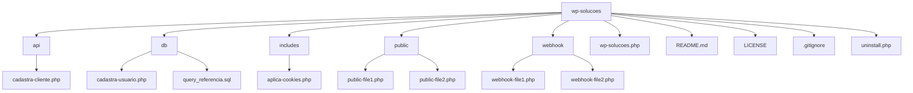

Ok, vamos documentar essa bagaça.

A lógica é a seguinte:
Estamos seguindo a seguinte estrutura de pastas:

Claro, aqui está um diagrama Mermaid que representa a estrutura de pastas do seu projeto:

### Explicação:

- **wp-solucoes**: Diretório raiz do seu plugin.
  - **api**: Contém arquivos relacionados à API.
    - **cadastra-cliente.php**: Arquivo para cadastro de clientes via API.
  - **db**: Contém arquivos relacionados ao banco de dados.
    - **cadastra-usuario.php**: Arquivo para cadastro de usuários no banco de dados.
    - **query_referencia.sql**: Arquivo SQL de referência.
  - **includes**: Contém arquivos de inclusão.
    - **aplica-cookies.php**: Arquivo para aplicação de cookies.
  - **public**: Contém arquivos públicos.
    - **public-file1.php**: Exemplo de arquivo público.
    - **public-file2.php**: Exemplo de arquivo público.
  - **webhook**: Contém arquivos relacionados a webhooks.
    - **webhook-file1.php**: Exemplo de arquivo de webhook.
    - **webhook-file2.php**: Exemplo de arquivo de webhook.
  - **wp-solucoes.php**: Arquivo principal do plugin.
  - **README.md**: Arquivo de documentação.
  - **LICENSE**: Arquivo de licença.
  - **.gitignore**: Arquivo de configuração do Git.
  - **uninstall.php**: Arquivo para desinstalação do plugin.

