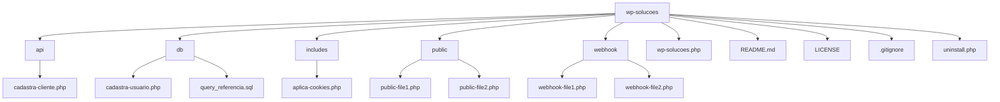

Ok, vamos documentar essa bagaça.

A lógica é a seguinte:
Estamos seguindo a seguinte estrutura de pastas:

```mermaid
graph TD;
    A[wp-solucoes] --> B[api]
    A --> C[db]
    A --> D[includes]
    A --> E[public]
    A --> F[webhook]
    A --> G[wp-solucoes.php]
    A --> H[README.md]
    A --> I[LICENSE]
    A --> J[.gitignore]
    A --> K[uninstall.php]
    
    B --> B1[cadastra-cliente.php]
    
    C --> C1[cadastra-usuario.php]
    C --> C2[query_referencia.sql]
    
    D --> D1[aplica-cookies.php]
    
    E --> E1[public-file1.php]
    E --> E2[public-file2.php]
    
    F --> F1[webhook-file1.php]
    F --> F2[webhook-file2.php]

```